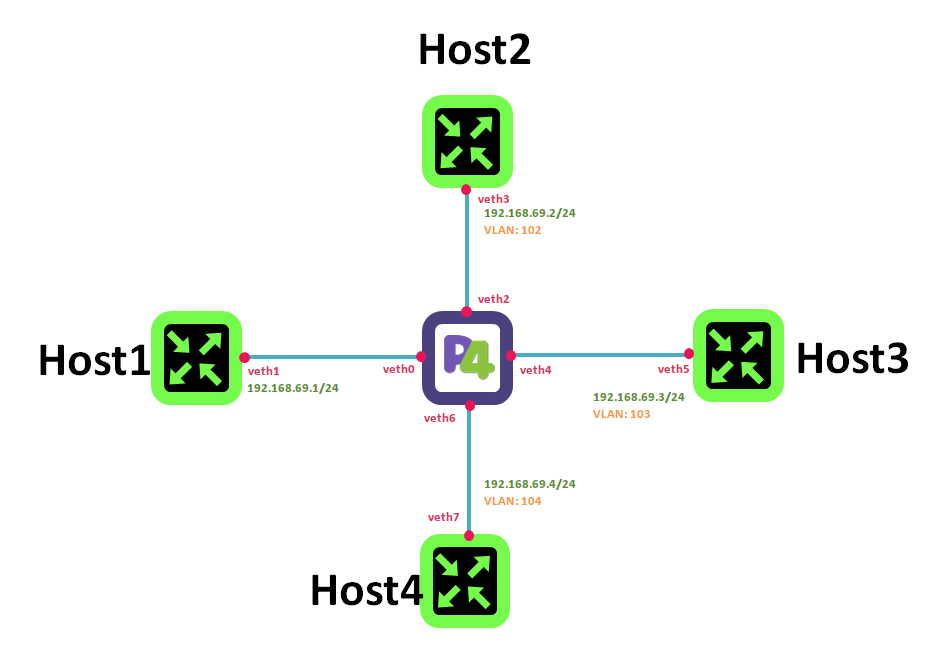

# Lab topology




# Unit test topology
The topology depicted in the diagram above is intended for showcasing the multicasting capabilities while performing different operations on each output port of a group.

## Components:
- `P4`: Is the P4 switch running BMV2.
- `HostX`: Is a host which can be configured with or without vlan tagging

## Sample configuration
Sample configuration configures each host in the same IPv4 network and sets different vlan for each of them:
- `Host1`: IP: 192.168.69.1/24 NO-tag
- `Host2`: IP: 192.168.69.2/24 VLAN: 102
- `Host3`: IP: 192.168.69.3/24 VLAN: 103
- `Host4`: IP: 192.168.69.4/24 VLAN: 104

# Run topology
```
git clone https://github.com/frederic-loui/RARE.git
cd RARE/00-unit-labs/0000-topology-vlan
make
```

# Clean topology
```
make clean
```

